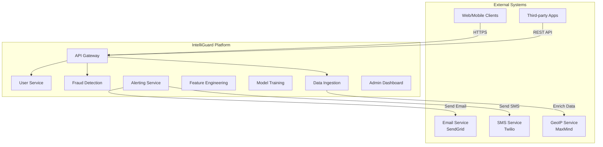
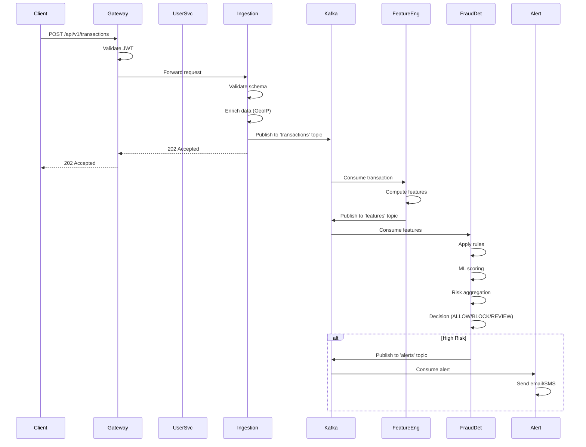
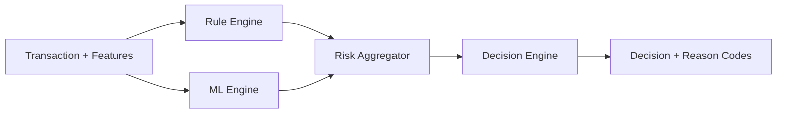
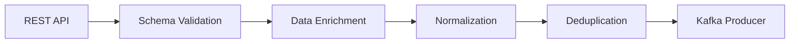
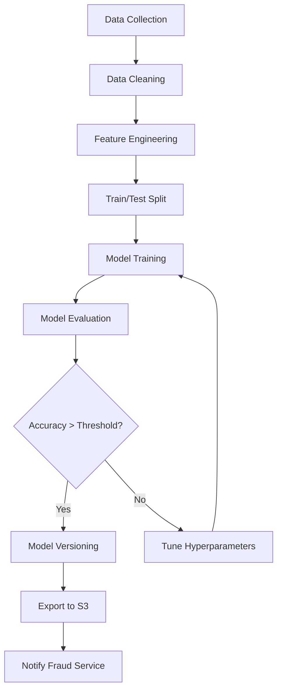
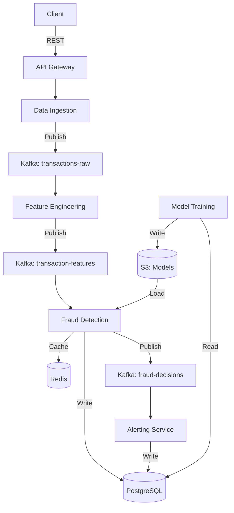
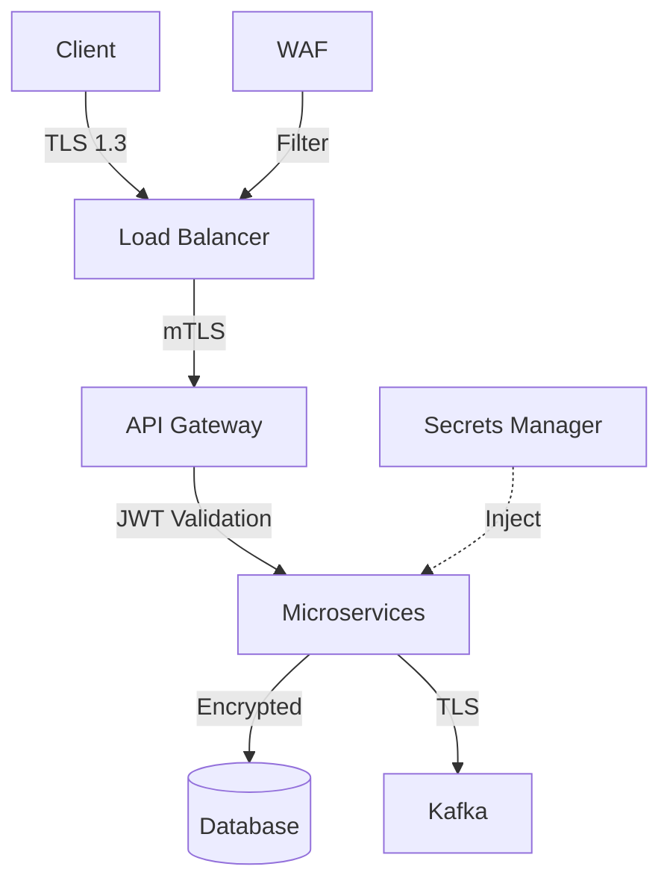
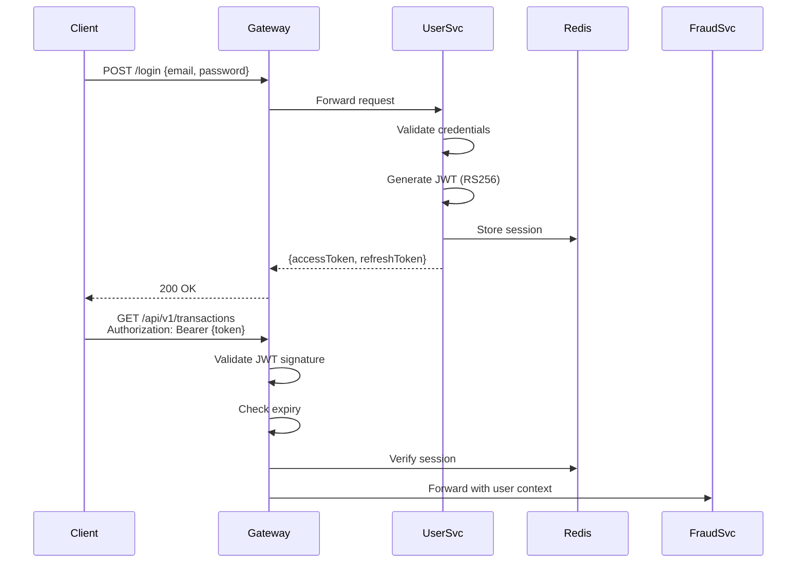
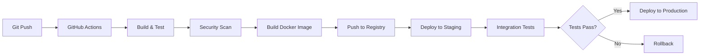

# IntelliGuard - System Architecture Document

**Version**: 1.0  
**Date**: November 2025  
**Status**: Draft  
**Classification**: Internal

---

## Table of Contents
1. [Architecture Overview](#1-architecture-overview)
2. [System Context](#2-system-context)
3. [Microservices Architecture](#3-microservices-architecture)
4. [Data Architecture](#4-data-architecture)
5. [Infrastructure Architecture](#5-infrastructure-architecture)
6. [Security Architecture](#6-security-architecture)
7. [Deployment Architecture](#7-deployment-architecture)
8. [Technology Stack](#8-technology-stack)

---

## 1. Architecture Overview

### 1.1 Architecture Principles

IntelliGuard follows these core architectural principles:

1. **Microservices Architecture**: Independently deployable services with clear boundaries
2. **Event-Driven Design**: Asynchronous communication via Apache Kafka
3. **API-First**: All services expose RESTful APIs with OpenAPI specs
4. **Cloud-Native**: Containerized, stateless, horizontally scalable
5. **Security by Design**: Zero-trust model, encryption everywhere
6. **Observability**: Comprehensive logging, metrics, and tracing
7. **Resilience**: Circuit breakers, retries, graceful degradation

### 1.2 Architecture Style

**Primary**: Microservices + Event-Driven Architecture  
**Communication**: Synchronous (REST) + Asynchronous (Kafka)  
**Data**: Polyglot persistence (PostgreSQL, Redis, Elasticsearch)  
**Deployment**: Containerized (Docker) → Orchestrated (Kubernetes)

---

## 2. System Context

### 2.1 System Context Diagram



### 2.2 External Dependencies

| System | Purpose | SLA | Fallback |
|--------|---------|-----|----------|
| SendGrid | Email notifications | 99.9% | AWS SES |
| Twilio | SMS alerts | 99.95% | AWS SNS |
| MaxMind GeoIP2 | IP geolocation | 99.9% | Cached data |
| Stripe/PayPal | Payment data | 99.99% | N/A |

---

## 3. Microservices Architecture

### 3.1 Service Inventory

| Service | Port | Purpose | Technology | Database |
|---------|------|---------|------------|----------|
| **Gateway Service** | 8080 | API routing, auth, rate limiting | Spring Cloud Gateway | Redis (session) |
| **User Service** | 8081 | Authentication, user management | Spring Boot | PostgreSQL |
| **Fraud Detection** | 8082 | Core fraud scoring engine | Spring Boot | PostgreSQL + Redis |
| **Data Ingestion** | 8083 | Transaction data intake | Spring Boot | Kafka |
| **Feature Engineering** | 8084 | Feature computation | Kafka Streams | Redis |
| **Model Training** | 8085 | ML model training | Python/FastAPI | S3 + PostgreSQL |
| **Alerting Service** | 8086 | Notifications | Spring Boot | PostgreSQL |
| **Eureka Server** | 8761 | Service discovery | Spring Cloud Eureka | In-memory |
| **Config Server** | 8888 | Centralized config | Spring Cloud Config | Git |

### 3.2 Service Interaction Diagram



### 3.3 Service Details

#### 3.3.1 Gateway Service

**Responsibilities**:
- Route requests to appropriate microservices
- JWT validation and user context propagation
- Rate limiting (Redis-backed)
- Request/response logging
- CORS handling
- Circuit breaker for downstream services

**Key Endpoints**:
- `/*` - Route to services based on path predicates

**Configuration**:
```yaml
spring:
  cloud:
    gateway:
      routes:
        - id: user-service
          uri: lb://user-service
          predicates:
            - Path=/api/v1/users/**
          filters:
            - StripPrefix=2
            - name: RequestRateLimiter
              args:
                redis-rate-limiter.replenishRate: 100
                redis-rate-limiter.burstCapacity: 200
```

**Resilience**:
- Circuit breaker: 50% error threshold, 10s timeout
- Retry: 3 attempts with exponential backoff

---

#### 3.3.2 User Service

**Responsibilities**:
- User registration and authentication
- JWT generation and validation
- Password management (reset, change)
- Role and permission management
- User profile CRUD operations

**Key Endpoints**:
| Method | Endpoint | Description |
|--------|----------|-------------|
| POST | `/api/v1/users/register` | Register new user |
| POST | `/api/v1/users/login` | Authenticate user |
| POST | `/api/v1/users/refresh` | Refresh JWT token |
| POST | `/api/v1/users/reset-password` | Request password reset |
| GET | `/api/v1/users/{id}` | Get user details |
| PUT | `/api/v1/users/{id}` | Update user profile |
| DELETE | `/api/v1/users/{id}` | Delete user (soft delete) |

**Database Schema**:
```sql
CREATE TABLE users (
    id BIGSERIAL PRIMARY KEY,
    email VARCHAR(255) UNIQUE NOT NULL,
    password_hash VARCHAR(255) NOT NULL,
    first_name VARCHAR(100),
    last_name VARCHAR(100),
    role VARCHAR(50) NOT NULL,
    status VARCHAR(20) NOT NULL,
    created_at TIMESTAMP NOT NULL DEFAULT NOW(),
    updated_at TIMESTAMP NOT NULL DEFAULT NOW(),
    last_login_at TIMESTAMP
);

CREATE TABLE roles (
    id BIGSERIAL PRIMARY KEY,
    name VARCHAR(50) UNIQUE NOT NULL,
    permissions JSONB NOT NULL
);

CREATE TABLE refresh_tokens (
    id BIGSERIAL PRIMARY KEY,
    user_id BIGINT REFERENCES users(id),
    token VARCHAR(500) UNIQUE NOT NULL,
    expires_at TIMESTAMP NOT NULL,
    created_at TIMESTAMP NOT NULL DEFAULT NOW()
);
```

**Security**:
- Password hashing: bcrypt (cost factor 12)
- JWT signing: RS256 (RSA with SHA-256)
- Token expiry: 1 hour (access), 7 days (refresh)
- Failed login tracking: Max 5 attempts, 15-min lockout

---

#### 3.3.3 Fraud Detection Service

**Responsibilities**:
- Real-time transaction scoring
- Rule engine execution
- ML model inference
- Risk aggregation
- Decision making (ALLOW/BLOCK/REVIEW)
- Fraud reason code generation

**Architecture**:


**Rule Types**:
1. **Threshold Rules**: Amount > $10,000 → HIGH_RISK
2. **Velocity Rules**: >5 transactions in 10 minutes → SUSPICIOUS
3. **Geo Rules**: Country mismatch → REVIEW
4. **Blacklist Rules**: User/IP/Device in blacklist → BLOCK
5. **Behavioral Rules**: Deviation from user pattern → REVIEW

**ML Models**:
- **Model 1**: Logistic Regression (baseline)
- **Model 2**: Random Forest (ensemble)
- **Model 3**: XGBoost (gradient boosting)
- **Model 4**: Neural Network (deep learning)

**Scoring Algorithm**:
```python
# Pseudo-code
def calculate_risk_score(transaction, features):
    rule_score = rule_engine.evaluate(transaction)  # 0-100
    ml_score = ml_model.predict(features)           # 0-100
    
    # Weighted average
    final_score = (0.4 * rule_score) + (0.6 * ml_score)
    
    # Decision thresholds
    if final_score >= 80:
        return Decision.BLOCK
    elif final_score >= 50:
        return Decision.REVIEW
    else:
        return Decision.ALLOW
```

**Database Schema**:
```sql
CREATE TABLE fraud_decisions (
    id BIGSERIAL PRIMARY KEY,
    transaction_id UUID NOT NULL,
    risk_score DECIMAL(5,2) NOT NULL,
    decision VARCHAR(20) NOT NULL,
    reason_codes JSONB NOT NULL,
    rule_scores JSONB,
    ml_scores JSONB,
    created_at TIMESTAMP NOT NULL DEFAULT NOW()
);

CREATE TABLE fraud_rules (
    id BIGSERIAL PRIMARY KEY,
    name VARCHAR(100) NOT NULL,
    description TEXT,
    rule_type VARCHAR(50) NOT NULL,
    conditions JSONB NOT NULL,
    action VARCHAR(20) NOT NULL,
    priority INT NOT NULL,
    is_active BOOLEAN DEFAULT true,
    created_at TIMESTAMP NOT NULL DEFAULT NOW(),
    updated_at TIMESTAMP NOT NULL DEFAULT NOW()
);
```

**Performance**:
- Target latency: <100ms (p95)
- Throughput: 10,000 TPS
- Cache hit rate: >90% (Redis)

---

#### 3.3.4 Data Ingestion Service

**Responsibilities**:
- Accept transaction data via REST API
- Validate schema (JSON Schema)
- Enrich data (GeoIP, device fingerprint)
- Normalize data
- Publish to Kafka
- Idempotency handling

**Key Endpoints**:
| Method | Endpoint | Description |
|--------|----------|-------------|
| POST | `/api/v1/transactions` | Ingest single transaction |
| POST | `/api/v1/transactions/batch` | Ingest batch (max 1000) |

**Data Flow**:


**Schema Validation**:
```json
{
  "$schema": "http://json-schema.org/draft-07/schema#",
  "type": "object",
  "required": ["transactionId", "userId", "amount", "currency"],
  "properties": {
    "transactionId": {"type": "string", "format": "uuid"},
    "userId": {"type": "string"},
    "amount": {"type": "number", "minimum": 0},
    "currency": {"type": "string", "pattern": "^[A-Z]{3}$"}
  }
}
```

**Kafka Topics**:
- `transactions-raw`: Raw ingested data
- `transactions-enriched`: Enriched and normalized data

**Idempotency**:
- Redis-based deduplication (TTL: 24 hours)
- Key: `idempotency:{transactionId}`

---

#### 3.3.5 Feature Engineering Service

**Responsibilities**:
- Consume transactions from Kafka
- Compute real-time features
- Aggregate historical features
- Publish features to Kafka

**Feature Categories**:
1. **Transaction Features**: Amount, currency, payment method
2. **User Features**: Account age, transaction history, avg amount
3. **Velocity Features**: Transactions per hour/day, amount velocity
4. **Geo Features**: Distance from last transaction, country risk score
5. **Device Features**: Device fingerprint, new device flag
6. **Peer Features**: Deviation from peer group behavior

**Implementation**: Kafka Streams

```java
StreamsBuilder builder = new StreamsBuilder();

KStream<String, Transaction> transactions = 
    builder.stream("transactions-enriched");

KTable<String, UserStats> userStats = transactions
    .groupByKey()
    .aggregate(
        UserStats::new,
        (key, txn, stats) -> stats.update(txn),
        Materialized.as("user-stats-store")
    );

KStream<String, Features> features = transactions
    .join(userStats, (txn, stats) -> computeFeatures(txn, stats));

features.to("transaction-features");
```

**State Store**: RocksDB (embedded in Kafka Streams)

---

#### 3.3.6 Model Training Service

**Responsibilities**:
- Collect training data from PostgreSQL
- Preprocess and clean data
- Train ML models
- Evaluate model performance
- Version and export models
- Notify Fraud Detection Service to reload models

**Tech Stack**: Python 3.11, FastAPI, Scikit-learn, XGBoost, MLflow

**Training Pipeline**:


**Model Versioning**: MLflow

```python
import mlflow

with mlflow.start_run():
    model = train_model(X_train, y_train)
    
    mlflow.log_param("model_type", "xgboost")
    mlflow.log_param("max_depth", 10)
    mlflow.log_metric("accuracy", 0.95)
    mlflow.log_metric("precision", 0.93)
    mlflow.log_metric("recall", 0.97)
    
    mlflow.sklearn.log_model(model, "fraud-model")
```

**Retraining Schedule**: Weekly (Sunday 2 AM UTC)

---

#### 3.3.7 Alerting & Notification Service

**Responsibilities**:
- Consume alerts from Kafka
- Route alerts based on priority
- Send multi-channel notifications (Email, SMS, Slack)
- Track alert status (sent, acknowledged, resolved)
- Alert deduplication

**Key Endpoints**:
| Method | Endpoint | Description |
|--------|----------|-------------|
| GET | `/api/v1/alerts` | List alerts (paginated) |
| GET | `/api/v1/alerts/{id}` | Get alert details |
| PUT | `/api/v1/alerts/{id}/acknowledge` | Acknowledge alert |
| PUT | `/api/v1/alerts/{id}/resolve` | Resolve alert |

**Alert Routing**:
```yaml
routing:
  CRITICAL:
    channels: [email, sms, slack]
    recipients: [on-call-team]
  HIGH:
    channels: [email, slack]
    recipients: [fraud-analysts]
  MEDIUM:
    channels: [email]
    recipients: [fraud-analysts]
  LOW:
    channels: [dashboard]
```

**Database Schema**:
```sql
CREATE TABLE alerts (
    id BIGSERIAL PRIMARY KEY,
    transaction_id UUID NOT NULL,
    severity VARCHAR(20) NOT NULL,
    title VARCHAR(255) NOT NULL,
    description TEXT,
    status VARCHAR(20) NOT NULL,
    acknowledged_at TIMESTAMP,
    acknowledged_by BIGINT REFERENCES users(id),
    resolved_at TIMESTAMP,
    resolved_by BIGINT REFERENCES users(id),
    created_at TIMESTAMP NOT NULL DEFAULT NOW()
);
```

---

#### 3.3.8 Admin Dashboard (Frontend)

**Responsibilities**:
- Real-time fraud monitoring
- Rule management UI
- User management UI
- Model performance metrics
- Alert management
- Reporting and analytics

**Tech Stack**: React 18, TypeScript, Tailwind CSS, Recharts

**Key Pages**:
1. **Dashboard**: Real-time metrics, charts, alerts
2. **Transactions**: Transaction list, search, filter
3. **Rules**: CRUD operations for fraud rules
4. **Users**: User management
5. **Models**: Model performance, A/B testing
6. **Alerts**: Alert list, acknowledge, resolve
7. **Reports**: Custom reports, scheduled exports

**Real-time Updates**: Server-Sent Events (SSE)

```typescript
const eventSource = new EventSource('/api/v1/stream/metrics');

eventSource.onmessage = (event) => {
  const metrics = JSON.parse(event.data);
  updateDashboard(metrics);
};
```

---

## 4. Data Architecture

### 4.1 Data Flow Diagram



### 4.2 Database Design

#### 4.2.1 PostgreSQL Schema

**Database**: `intelli_guard`

**Tables**:
- `users` - User accounts
- `roles` - User roles and permissions
- `refresh_tokens` - JWT refresh tokens
- `transactions` - Transaction records
- `fraud_decisions` - Fraud scoring results
- `fraud_rules` - Fraud detection rules
- `alerts` - Fraud alerts
- `audit_logs` - System audit trail

**Indexes**:
```sql
CREATE INDEX idx_transactions_user_id ON transactions(user_id);
CREATE INDEX idx_transactions_created_at ON transactions(created_at);
CREATE INDEX idx_fraud_decisions_transaction_id ON fraud_decisions(transaction_id);
CREATE INDEX idx_fraud_decisions_created_at ON fraud_decisions(created_at);
CREATE INDEX idx_alerts_status ON alerts(status);
```

**Partitioning**:
```sql
-- Partition transactions by month
CREATE TABLE transactions_2025_11 PARTITION OF transactions
    FOR VALUES FROM ('2025-11-01') TO ('2025-12-01');
```

#### 4.2.2 Redis Data Structures

| Key Pattern | Type | TTL | Purpose |
|-------------|------|-----|---------|
| `session:{userId}` | Hash | 1 hour | User session data |
| `rate-limit:{apiKey}` | String | 1 minute | API rate limiting |
| `idempotency:{txnId}` | String | 24 hours | Duplicate detection |
| `rule-cache:{ruleId}` | Hash | 1 hour | Cached fraud rules |
| `user-stats:{userId}` | Hash | 1 hour | User statistics |
| `model:{version}` | String | Indefinite | Serialized ML model |

#### 4.2.3 Kafka Topics

| Topic | Partitions | Replication | Retention | Purpose |
|-------|------------|-------------|-----------|---------|
| `transactions-raw` | 10 | 3 | 7 days | Raw transaction data |
| `transactions-enriched` | 10 | 3 | 7 days | Enriched transactions |
| `transaction-features` | 10 | 3 | 7 days | Computed features |
| `fraud-decisions` | 10 | 3 | 30 days | Fraud scoring results |
| `alerts` | 5 | 3 | 30 days | Fraud alerts |

---

## 5. Infrastructure Architecture

### 5.1 Development Environment

**Docker Compose**:
```yaml
version: '3.8'

services:
  zookeeper:
    image: confluentinc/cp-zookeeper:7.3.0
    ports:
      - "2181:2181"
  
  kafka:
    image: confluentinc/cp-kafka:7.3.0
    ports:
      - "9092:9092"
    depends_on:
      - zookeeper
  
  postgres:
    image: postgres:15-alpine
    ports:
      - "5432:5432"
  
  redis:
    image: redis:7-alpine
    ports:
      - "6379:6379"
  
  elasticsearch:
    image: docker.elastic.co/elasticsearch/elasticsearch:8.7.0
    ports:
      - "9200:9200"
```

### 5.2 Production Environment (Kubernetes)

**Cluster Specifications**:
- **Node Pool**: 3 nodes (t3.xlarge: 4 vCPU, 16 GB RAM)
- **Auto-scaling**: 3-10 nodes based on CPU/memory
- **Availability Zones**: 3 AZs for high availability

**Namespace Structure**:
- `intelli-guard-prod` - Production services
- `intelli-guard-staging` - Staging environment
- `monitoring` - Prometheus, Grafana
- `logging` - ELK stack

**Resource Allocation**:
```yaml
resources:
  requests:
    memory: "512Mi"
    cpu: "250m"
  limits:
    memory: "1Gi"
    cpu: "500m"
```

---

## 6. Security Architecture

### 6.1 Security Layers



### 6.2 Authentication & Authorization

**Authentication Flow**:


**JWT Structure**:
```json
{
  "header": {
    "alg": "RS256",
    "typ": "JWT"
  },
  "payload": {
    "sub": "user-123",
    "email": "user@example.com",
    "role": "ANALYST",
    "permissions": ["READ_TRANSACTIONS", "MANAGE_RULES"],
    "iat": 1700000000,
    "exp": 1700003600
  }
}
```

### 6.3 Data Encryption

| Layer | Encryption | Key Management |
|-------|------------|----------------|
| **In Transit** | TLS 1.3 | Let's Encrypt / ACM |
| **At Rest (DB)** | AES-256 | AWS KMS / HashiCorp Vault |
| **At Rest (S3)** | AES-256 | S3 SSE-KMS |
| **Application** | Field-level (PII) | Vault Transit Engine |

### 6.4 Network Security

**Firewall Rules**:
- Allow HTTPS (443) from internet
- Allow internal service-to-service communication
- Deny all other inbound traffic

**Service Mesh** (Phase 3):
- Mutual TLS between services
- Traffic encryption
- Policy enforcement

---

## 7. Deployment Architecture

### 7.1 CI/CD Pipeline



**Pipeline Stages**:
1. **Build**: Maven/Gradle compile
2. **Unit Tests**: JUnit, Mockito
3. **Security Scan**: SonarQube, Snyk, Trivy
4. **Docker Build**: Multi-stage builds
5. **Push**: Docker Hub / ECR
6. **Deploy Staging**: ArgoCD
7. **Integration Tests**: Postman/Newman
8. **Deploy Production**: ArgoCD (manual approval)

### 7.2 Deployment Strategy

**Blue-Green Deployment**:
- Maintain two identical environments (Blue, Green)
- Deploy to inactive environment
- Switch traffic after validation
- Instant rollback capability

**Canary Deployment**:
- Deploy to 10% of traffic
- Monitor metrics (error rate, latency)
- Gradually increase to 100%
- Rollback if metrics degrade

---

## 8. Technology Stack

### 8.1 Backend

| Component | Technology | Version |
|-----------|------------|---------|
| Language | Java | 17 LTS |
| Framework | Spring Boot | 3.5.6 |
| API Gateway | Spring Cloud Gateway | 2025.0.0 |
| Service Discovery | Netflix Eureka | 2025.0.0 |
| Config Management | Spring Cloud Config | 2025.0.0 |
| Messaging | Apache Kafka | 3.6.0 |
| Caching | Redis | 7.2 |
| Database | PostgreSQL | 15.4 |
| Search | Elasticsearch | 8.7.0 |
| ORM | Spring Data JPA | 3.5.6 |
| Security | Spring Security | 6.5.0 |
| Testing | JUnit 5, Mockito | 5.10.0 |

### 8.2 ML/AI

| Component | Technology | Version |
|-----------|------------|---------|
| Language | Python | 3.11 |
| ML Framework | Scikit-learn | 1.3.0 |
| Gradient Boosting | XGBoost | 2.0.0 |
| Deep Learning | TensorFlow | 2.14.0 |
| API Framework | FastAPI | 0.104.0 |
| MLOps | MLflow | 2.8.0 |
| Orchestration | Apache Airflow | 2.7.0 |

### 8.3 Frontend

| Component | Technology | Version |
|-----------|------------|---------|
| Framework | React | 18.2.0 |
| Language | TypeScript | 5.2.0 |
| Styling | Tailwind CSS | 3.3.0 |
| State Management | Redux Toolkit | 1.9.0 |
| Charts | Recharts | 2.8.0 |
| HTTP Client | Axios | 1.5.0 |
| Build Tool | Vite | 4.5.0 |

### 8.4 DevOps

| Component | Technology | Version |
|-----------|------------|---------|
| Containerization | Docker | 24.0 |
| Orchestration | Kubernetes | 1.28 |
| CI/CD | GitHub Actions | N/A |
| GitOps | ArgoCD | 2.9.0 |
| IaC | Terraform | 1.6.0 |
| Monitoring | Prometheus | 2.47.0 |
| Visualization | Grafana | 10.2.0 |
| Logging | ELK Stack | 8.7.0 |
| Tracing | Jaeger | 1.50.0 |

---

## 9. Architecture Decision Records (ADRs)

### ADR-001: Microservices vs Monolith

**Status**: Accepted  
**Decision**: Microservices architecture  
**Rationale**:
- Independent scaling of fraud detection service
- Technology diversity (Java + Python)
- Team autonomy
- Fault isolation

**Consequences**:
- Increased operational complexity
- Distributed tracing required
- Network latency between services

---

### ADR-002: Kafka vs RabbitMQ

**Status**: Accepted  
**Decision**: Apache Kafka  
**Rationale**:
- High throughput (10K+ TPS)
- Event sourcing capability
- Stream processing (Kafka Streams)
- Log retention for replay

**Consequences**:
- Higher operational complexity
- Requires Zookeeper (until KRaft)

---

### ADR-003: PostgreSQL vs MongoDB

**Status**: Accepted  
**Decision**: PostgreSQL for primary database  
**Rationale**:
- ACID compliance for transactions
- Strong consistency
- Rich query capabilities (SQL)
- JSON support (JSONB)

**Consequences**:
- Vertical scaling limits
- Sharding complexity

---

**Document Control**

| Version | Date | Author | Changes |
|---------|------|--------|---------|
| 1.0 | Nov 2025 | Adil khan | Initial draft |
