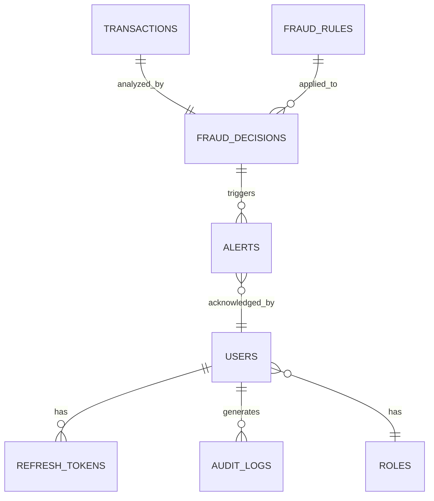

# IntelliGuard - Database Schema Document

**Version**: 1.0  
**Date**: November 2025  
**Database**: PostgreSQL 15.4  
**Schema Version**: 1.0.0

---

## Table of Contents
1. [Schema Overview](#1-schema-overview)
2. [User Management Schema](#2-user-management-schema)
3. [Transaction Schema](#3-transaction-schema)
4. [Fraud Detection Schema](#4-fraud-detection-schema)
5. [Alerting Schema](#5-alerting-schema)
6. [Audit Schema](#6-audit-schema)
7. [Indexes & Performance](#7-indexes--performance)
8. [Data Retention & Archival](#8-data-retention--archival)

---

## 1. Schema Overview

### 1.1 Database Structure



### 1.2 Schema Naming Conventions

- **Tables**: Lowercase with underscores (e.g., `fraud_decisions`)
- **Columns**: Lowercase with underscores (e.g., `created_at`)
- **Indexes**: `idx_{table}_{column}` (e.g., `idx_users_email`)
- **Foreign Keys**: `fk_{table}_{referenced_table}` (e.g., `fk_alerts_users`)
- **Primary Keys**: `{table}_pkey` (auto-generated)

---

## 2. User Management Schema

### 2.1 users

Stores user account information.

```sql
CREATE TABLE users (
    id BIGSERIAL PRIMARY KEY,
    email VARCHAR(255) UNIQUE NOT NULL,
    password_hash VARCHAR(255) NOT NULL,
    first_name VARCHAR(100),
    last_name VARCHAR(100),
    role_id BIGINT NOT NULL REFERENCES roles(id),
    status VARCHAR(20) NOT NULL DEFAULT 'PENDING_VERIFICATION',
    failed_login_attempts INT DEFAULT 0,
    locked_until TIMESTAMP,
    email_verified BOOLEAN DEFAULT FALSE,
    email_verification_token VARCHAR(255),
    password_reset_token VARCHAR(255),
    password_reset_expires_at TIMESTAMP,
    last_password_change_at TIMESTAMP,
    created_at TIMESTAMP NOT NULL DEFAULT NOW(),
    updated_at TIMESTAMP NOT NULL DEFAULT NOW(),
    last_login_at TIMESTAMP,
    deleted_at TIMESTAMP,
    
    CONSTRAINT chk_status CHECK (status IN ('PENDING_VERIFICATION', 'ACTIVE', 'SUSPENDED', 'DELETED')),
    CONSTRAINT chk_email_format CHECK (email ~* '^[A-Za-z0-9._%+-]+@[A-Za-z0-9.-]+\.[A-Z|a-z]{2,}$')
);

CREATE INDEX idx_users_email ON users(email);
CREATE INDEX idx_users_status ON users(status);
CREATE INDEX idx_users_role_id ON users(role_id);
CREATE INDEX idx_users_created_at ON users(created_at);
```

**Columns**:
- `id`: Unique user identifier
- `email`: User email (unique, validated)
- `password_hash`: bcrypt hashed password (cost factor 12)
- `role_id`: Foreign key to roles table
- `status`: Account status (PENDING_VERIFICATION, ACTIVE, SUSPENDED, DELETED)
- `failed_login_attempts`: Counter for failed login attempts
- `locked_until`: Account lock expiry timestamp
- `deleted_at`: Soft delete timestamp

---

### 2.2 roles

Defines user roles and permissions.

```sql
CREATE TABLE roles (
    id BIGSERIAL PRIMARY KEY,
    name VARCHAR(50) UNIQUE NOT NULL,
    description TEXT,
    permissions JSONB NOT NULL,
    created_at TIMESTAMP NOT NULL DEFAULT NOW(),
    updated_at TIMESTAMP NOT NULL DEFAULT NOW(),
    
    CONSTRAINT chk_role_name CHECK (name IN ('ADMIN', 'ANALYST', 'VIEWER', 'API_USER'))
);

CREATE INDEX idx_roles_name ON roles(name);

-- Insert default roles
INSERT INTO roles (name, description, permissions) VALUES
('ADMIN', 'Full system access', '["*"]'::jsonb),
('ANALYST', 'Fraud analysis and rule management', '["READ_TRANSACTIONS", "MANAGE_RULES", "MANAGE_ALERTS"]'::jsonb),
('VIEWER', 'Read-only access', '["READ_TRANSACTIONS", "READ_ALERTS"]'::jsonb),
('API_USER', 'API access for transaction ingestion', '["INGEST_TRANSACTIONS"]'::jsonb);
```

---

### 2.3 refresh_tokens

Stores JWT refresh tokens.

```sql
CREATE TABLE refresh_tokens (
    id BIGSERIAL PRIMARY KEY,
    user_id BIGINT NOT NULL REFERENCES users(id) ON DELETE CASCADE,
    token VARCHAR(500) UNIQUE NOT NULL,
    expires_at TIMESTAMP NOT NULL,
    revoked BOOLEAN DEFAULT FALSE,
    revoked_at TIMESTAMP,
    created_at TIMESTAMP NOT NULL DEFAULT NOW(),
    
    CONSTRAINT chk_expires_future CHECK (expires_at > created_at)
);

CREATE INDEX idx_refresh_tokens_user_id ON refresh_tokens(user_id);
CREATE INDEX idx_refresh_tokens_token ON refresh_tokens(token);
CREATE INDEX idx_refresh_tokens_expires_at ON refresh_tokens(expires_at);
```

---

### 2.4 password_history

Prevents password reuse.

```sql
CREATE TABLE password_history (
    id BIGSERIAL PRIMARY KEY,
    user_id BIGINT NOT NULL REFERENCES users(id) ON DELETE CASCADE,
    password_hash VARCHAR(255) NOT NULL,
    created_at TIMESTAMP NOT NULL DEFAULT NOW()
);

CREATE INDEX idx_password_history_user_id ON password_history(user_id);
```

---

## 3. Transaction Schema

### 3.1 transactions

Stores all transaction data.

```sql
CREATE TABLE transactions (
    id BIGSERIAL PRIMARY KEY,
    transaction_id UUID UNIQUE NOT NULL,
    user_id VARCHAR(255) NOT NULL,
    amount DECIMAL(15,2) NOT NULL,
    currency VARCHAR(3) NOT NULL,
    merchant_id VARCHAR(255),
    merchant_name VARCHAR(255),
    payment_method VARCHAR(50) NOT NULL,
    card_last4 VARCHAR(4),
    card_bin VARCHAR(6),
    transaction_timestamp TIMESTAMP NOT NULL,
    ip_address INET,
    device_fingerprint VARCHAR(255),
    user_agent TEXT,
    geolocation JSONB,
    metadata JSONB,
    created_at TIMESTAMP NOT NULL DEFAULT NOW(),
    
    CONSTRAINT chk_amount_positive CHECK (amount >= 0),
    CONSTRAINT chk_currency_format CHECK (currency ~ '^[A-Z]{3}$'),
    CONSTRAINT chk_payment_method CHECK (payment_method IN ('CARD', 'BANK_TRANSFER', 'WALLET', 'CRYPTO'))
);

CREATE INDEX idx_transactions_transaction_id ON transactions(transaction_id);
CREATE INDEX idx_transactions_user_id ON transactions(user_id);
CREATE INDEX idx_transactions_timestamp ON transactions(transaction_timestamp);
CREATE INDEX idx_transactions_created_at ON transactions(created_at);
CREATE INDEX idx_transactions_amount ON transactions(amount);
CREATE INDEX idx_transactions_ip_address ON transactions(ip_address);

-- GIN index for JSONB columns
CREATE INDEX idx_transactions_geolocation ON transactions USING GIN (geolocation);
CREATE INDEX idx_transactions_metadata ON transactions USING GIN (metadata);
```

**Partitioning Strategy**: Partition by month for performance

```sql
-- Create partitioned table
CREATE TABLE transactions_partitioned (
    LIKE transactions INCLUDING ALL
) PARTITION BY RANGE (transaction_timestamp);

-- Create monthly partitions
CREATE TABLE transactions_2025_11 PARTITION OF transactions_partitioned
    FOR VALUES FROM ('2025-11-01') TO ('2025-12-01');

CREATE TABLE transactions_2025_12 PARTITION OF transactions_partitioned
    FOR VALUES FROM ('2025-12-01') TO ('2026-01-01');
```

---

## 4. Fraud Detection Schema

### 4.1 fraud_decisions

Stores fraud analysis results.

```sql
CREATE TABLE fraud_decisions (
    id BIGSERIAL PRIMARY KEY,
    transaction_id UUID NOT NULL REFERENCES transactions(transaction_id),
    risk_score DECIMAL(5,2) NOT NULL,
    decision VARCHAR(20) NOT NULL,
    reason_codes JSONB NOT NULL,
    rule_scores JSONB,
    ml_scores JSONB,
    features JSONB,
    model_version VARCHAR(50),
    processing_time_ms INT,
    overridden BOOLEAN DEFAULT FALSE,
    override_decision VARCHAR(20),
    override_reason TEXT,
    overridden_by BIGINT REFERENCES users(id),
    overridden_at TIMESTAMP,
    created_at TIMESTAMP NOT NULL DEFAULT NOW(),
    
    CONSTRAINT chk_risk_score_range CHECK (risk_score >= 0 AND risk_score <= 100),
    CONSTRAINT chk_decision CHECK (decision IN ('ALLOW', 'BLOCK', 'REVIEW')),
    CONSTRAINT chk_override_decision CHECK (override_decision IN ('ALLOW', 'BLOCK', 'REVIEW'))
);

CREATE INDEX idx_fraud_decisions_transaction_id ON fraud_decisions(transaction_id);
CREATE INDEX idx_fraud_decisions_decision ON fraud_decisions(decision);
CREATE INDEX idx_fraud_decisions_risk_score ON fraud_decisions(risk_score);
CREATE INDEX idx_fraud_decisions_created_at ON fraud_decisions(created_at);
CREATE INDEX idx_fraud_decisions_overridden ON fraud_decisions(overridden);

-- GIN indexes for JSONB
CREATE INDEX idx_fraud_decisions_reason_codes ON fraud_decisions USING GIN (reason_codes);
CREATE INDEX idx_fraud_decisions_features ON fraud_decisions USING GIN (features);
```

---

### 4.2 fraud_rules

Stores fraud detection rules.

```sql
CREATE TABLE fraud_rules (
    id BIGSERIAL PRIMARY KEY,
    name VARCHAR(100) NOT NULL,
    description TEXT,
    rule_type VARCHAR(50) NOT NULL,
    conditions JSONB NOT NULL,
    action VARCHAR(20) NOT NULL,
    priority INT NOT NULL,
    is_active BOOLEAN DEFAULT TRUE,
    version INT DEFAULT 1,
    created_by BIGINT REFERENCES users(id),
    created_at TIMESTAMP NOT NULL DEFAULT NOW(),
    updated_at TIMESTAMP NOT NULL DEFAULT NOW(),
    activated_at TIMESTAMP,
    deactivated_at TIMESTAMP,
    
    CONSTRAINT chk_rule_type CHECK (rule_type IN ('THRESHOLD', 'VELOCITY', 'GEO', 'BLACKLIST', 'BEHAVIORAL')),
    CONSTRAINT chk_action CHECK (action IN ('ALLOW', 'BLOCK', 'REVIEW', 'SCORE')),
    CONSTRAINT chk_priority_positive CHECK (priority > 0)
);

CREATE INDEX idx_fraud_rules_is_active ON fraud_rules(is_active);
CREATE INDEX idx_fraud_rules_rule_type ON fraud_rules(rule_type);
CREATE INDEX idx_fraud_rules_priority ON fraud_rules(priority);
CREATE INDEX idx_fraud_rules_conditions ON fraud_rules USING GIN (conditions);
```

---

### 4.3 rule_performance

Tracks rule performance metrics.

```sql
CREATE TABLE rule_performance (
    id BIGSERIAL PRIMARY KEY,
    rule_id BIGINT NOT NULL REFERENCES fraud_rules(id),
    date DATE NOT NULL,
    total_evaluations INT DEFAULT 0,
    true_positives INT DEFAULT 0,
    false_positives INT DEFAULT 0,
    true_negatives INT DEFAULT 0,
    false_negatives INT DEFAULT 0,
    precision DECIMAL(5,4),
    recall DECIMAL(5,4),
    f1_score DECIMAL(5,4),
    created_at TIMESTAMP NOT NULL DEFAULT NOW(),
    
    CONSTRAINT uq_rule_performance_rule_date UNIQUE (rule_id, date)
);

CREATE INDEX idx_rule_performance_rule_id ON rule_performance(rule_id);
CREATE INDEX idx_rule_performance_date ON rule_performance(date);
```

---

### 4.4 ml_models

Stores ML model metadata.

```sql
CREATE TABLE ml_models (
    id BIGSERIAL PRIMARY KEY,
    name VARCHAR(100) NOT NULL,
    version VARCHAR(50) NOT NULL,
    model_type VARCHAR(50) NOT NULL,
    algorithm VARCHAR(100),
    hyperparameters JSONB,
    training_metrics JSONB,
    feature_importance JSONB,
    model_path VARCHAR(500),
    is_active BOOLEAN DEFAULT FALSE,
    trained_by BIGINT REFERENCES users(id),
    trained_at TIMESTAMP NOT NULL,
    activated_at TIMESTAMP,
    deactivated_at TIMESTAMP,
    created_at TIMESTAMP NOT NULL DEFAULT NOW(),
    
    CONSTRAINT uq_ml_models_name_version UNIQUE (name, version),
    CONSTRAINT chk_model_type CHECK (model_type IN ('CLASSIFICATION', 'REGRESSION', 'ENSEMBLE'))
);

CREATE INDEX idx_ml_models_is_active ON ml_models(is_active);
CREATE INDEX idx_ml_models_version ON ml_models(version);
```

---

## 5. Alerting Schema

### 5.1 alerts

Stores fraud alerts.

```sql
CREATE TABLE alerts (
    id BIGSERIAL PRIMARY KEY,
    transaction_id UUID NOT NULL REFERENCES transactions(transaction_id),
    fraud_decision_id BIGINT REFERENCES fraud_decisions(id),
    severity VARCHAR(20) NOT NULL,
    title VARCHAR(255) NOT NULL,
    description TEXT,
    status VARCHAR(20) NOT NULL DEFAULT 'OPEN',
    assigned_to BIGINT REFERENCES users(id),
    acknowledged_by BIGINT REFERENCES users(id),
    acknowledged_at TIMESTAMP,
    resolved_by BIGINT REFERENCES users(id),
    resolved_at TIMESTAMP,
    resolution TEXT,
    notes TEXT,
    created_at TIMESTAMP NOT NULL DEFAULT NOW(),
    updated_at TIMESTAMP NOT NULL DEFAULT NOW(),
    
    CONSTRAINT chk_severity CHECK (severity IN ('CRITICAL', 'HIGH', 'MEDIUM', 'LOW')),
    CONSTRAINT chk_status CHECK (status IN ('OPEN', 'ACKNOWLEDGED', 'RESOLVED', 'CLOSED'))
);

CREATE INDEX idx_alerts_transaction_id ON alerts(transaction_id);
CREATE INDEX idx_alerts_severity ON alerts(severity);
CREATE INDEX idx_alerts_status ON alerts(status);
CREATE INDEX idx_alerts_assigned_to ON alerts(assigned_to);
CREATE INDEX idx_alerts_created_at ON alerts(created_at);
```

---

### 5.2 notifications

Stores notification delivery status.

```sql
CREATE TABLE notifications (
    id BIGSERIAL PRIMARY KEY,
    alert_id BIGINT NOT NULL REFERENCES alerts(id),
    channel VARCHAR(50) NOT NULL,
    recipient VARCHAR(255) NOT NULL,
    status VARCHAR(20) NOT NULL DEFAULT 'PENDING',
    sent_at TIMESTAMP,
    delivered_at TIMESTAMP,
    error_message TEXT,
    retry_count INT DEFAULT 0,
    created_at TIMESTAMP NOT NULL DEFAULT NOW(),
    
    CONSTRAINT chk_channel CHECK (channel IN ('EMAIL', 'SMS', 'SLACK', 'WEBHOOK', 'PUSH')),
    CONSTRAINT chk_notification_status CHECK (status IN ('PENDING', 'SENT', 'DELIVERED', 'FAILED'))
);

CREATE INDEX idx_notifications_alert_id ON notifications(alert_id);
CREATE INDEX idx_notifications_status ON notifications(status);
CREATE INDEX idx_notifications_created_at ON notifications(created_at);
```

---

## 6. Audit Schema

### 6.1 audit_logs

Comprehensive audit trail.

```sql
CREATE TABLE audit_logs (
    id BIGSERIAL PRIMARY KEY,
    user_id BIGINT REFERENCES users(id),
    action VARCHAR(100) NOT NULL,
    entity_type VARCHAR(100),
    entity_id VARCHAR(255),
    old_values JSONB,
    new_values JSONB,
    ip_address INET,
    user_agent TEXT,
    request_id VARCHAR(255),
    created_at TIMESTAMP NOT NULL DEFAULT NOW(),
    
    CONSTRAINT chk_action CHECK (action IN (
        'USER_LOGIN', 'USER_LOGOUT', 'USER_CREATED', 'USER_UPDATED', 'USER_DELETED',
        'RULE_CREATED', 'RULE_UPDATED', 'RULE_DELETED', 'RULE_ACTIVATED', 'RULE_DEACTIVATED',
        'DECISION_OVERRIDDEN', 'ALERT_ACKNOWLEDGED', 'ALERT_RESOLVED',
        'MODEL_DEPLOYED', 'CONFIG_CHANGED'
    ))
);

CREATE INDEX idx_audit_logs_user_id ON audit_logs(user_id);
CREATE INDEX idx_audit_logs_action ON audit_logs(action);
CREATE INDEX idx_audit_logs_entity_type ON audit_logs(entity_type);
CREATE INDEX idx_audit_logs_created_at ON audit_logs(created_at);
CREATE INDEX idx_audit_logs_request_id ON audit_logs(request_id);
```

**Partitioning**: Partition by month for performance

```sql
CREATE TABLE audit_logs_partitioned (
    LIKE audit_logs INCLUDING ALL
) PARTITION BY RANGE (created_at);
```

---

## 7. Indexes & Performance

### 7.1 Composite Indexes

```sql
-- User lookup by email and status
CREATE INDEX idx_users_email_status ON users(email, status) WHERE deleted_at IS NULL;

-- Transaction lookup by user and time range
CREATE INDEX idx_transactions_user_timestamp ON transactions(user_id, transaction_timestamp DESC);

-- Fraud decisions by decision and risk score
CREATE INDEX idx_fraud_decisions_decision_score ON fraud_decisions(decision, risk_score DESC);

-- Alerts by status and severity
CREATE INDEX idx_alerts_status_severity ON alerts(status, severity, created_at DESC);
```

### 7.2 Partial Indexes

```sql
-- Active users only
CREATE INDEX idx_users_active ON users(id) WHERE status = 'ACTIVE' AND deleted_at IS NULL;

-- Active fraud rules only
CREATE INDEX idx_fraud_rules_active ON fraud_rules(priority) WHERE is_active = TRUE;

-- Open alerts only
CREATE INDEX idx_alerts_open ON alerts(created_at DESC) WHERE status IN ('OPEN', 'ACKNOWLEDGED');
```

### 7.3 Full-Text Search

```sql
-- Full-text search on alert descriptions
ALTER TABLE alerts ADD COLUMN description_tsv tsvector;

CREATE INDEX idx_alerts_description_fts ON alerts USING GIN (description_tsv);

-- Trigger to update tsvector
CREATE TRIGGER tsvector_update_alerts
BEFORE INSERT OR UPDATE ON alerts
FOR EACH ROW EXECUTE FUNCTION
tsvector_update_trigger(description_tsv, 'pg_catalog.english', description);
```

---

## 8. Data Retention & Archival

### 8.1 Retention Policies

| Table | Hot Storage | Cold Storage | Total Retention |
|-------|-------------|--------------|-----------------|
| `transactions` | 90 days | 2 years | 2 years |
| `fraud_decisions` | 90 days | 2 years | 2 years |
| `alerts` | 1 year | 7 years | 7 years |
| `audit_logs` | 90 days | 7 years | 7 years |
| `users` | Until deletion | N/A | Indefinite |
| `refresh_tokens` | Until expiry | N/A | Auto-delete |

### 8.2 Archival Procedure

```sql
-- Archive old transactions to cold storage (S3)
CREATE OR REPLACE FUNCTION archive_old_transactions()
RETURNS void AS $$
BEGIN
    -- Export to S3 (via pg_dump or COPY)
    COPY (
        SELECT * FROM transactions 
        WHERE created_at < NOW() - INTERVAL '90 days'
    ) TO PROGRAM 'aws s3 cp - s3://intelliguard-archive/transactions/$(date +%Y%m%d).csv';
    
    -- Delete archived records
    DELETE FROM transactions 
    WHERE created_at < NOW() - INTERVAL '90 days';
END;
$$ LANGUAGE plpgsql;

-- Schedule via cron or pg_cron
SELECT cron.schedule('archive-transactions', '0 2 * * 0', 'SELECT archive_old_transactions()');
```

### 8.3 Data Cleanup

```sql
-- Delete expired refresh tokens
DELETE FROM refresh_tokens WHERE expires_at < NOW();

-- Delete old password history (keep last 5)
DELETE FROM password_history
WHERE id NOT IN (
    SELECT id FROM password_history
    WHERE user_id = password_history.user_id
    ORDER BY created_at DESC
    LIMIT 5
);
```

---

## 9. Database Migrations

### 9.1 Migration Tool

**Tool**: Flyway

**Migration Files**: `src/main/resources/db/migration/`

**Naming Convention**: `V{version}__{description}.sql`

Example: `V1.0.0__initial_schema.sql`

### 9.2 Sample Migration

```sql
-- V1.0.0__initial_schema.sql
CREATE TABLE users (
    id BIGSERIAL PRIMARY KEY,
    email VARCHAR(255) UNIQUE NOT NULL,
    ...
);

-- V1.0.1__add_user_status.sql
ALTER TABLE users ADD COLUMN status VARCHAR(20) DEFAULT 'ACTIVE';

-- V1.0.2__create_fraud_rules.sql
CREATE TABLE fraud_rules (
    ...
);
```

---

## 10. Backup & Recovery

### 10.1 Backup Strategy

- **Full Backup**: Daily at 2 AM UTC
- **Incremental Backup**: Every 6 hours
- **WAL Archiving**: Continuous
- **Retention**: 30 days

### 10.2 Backup Commands

```bash
# Full backup
pg_dump -h localhost -U admin -d intelli_guard -F c -f backup_$(date +%Y%m%d).dump

# Restore
pg_restore -h localhost -U admin -d intelli_guard -c backup_20251122.dump
```

---

**Document Control**

| Version | Date | Author | Changes |
|---------|------|--------|---------|
| 1.0 | Nov 2025 | Database Team | Initial schema |
