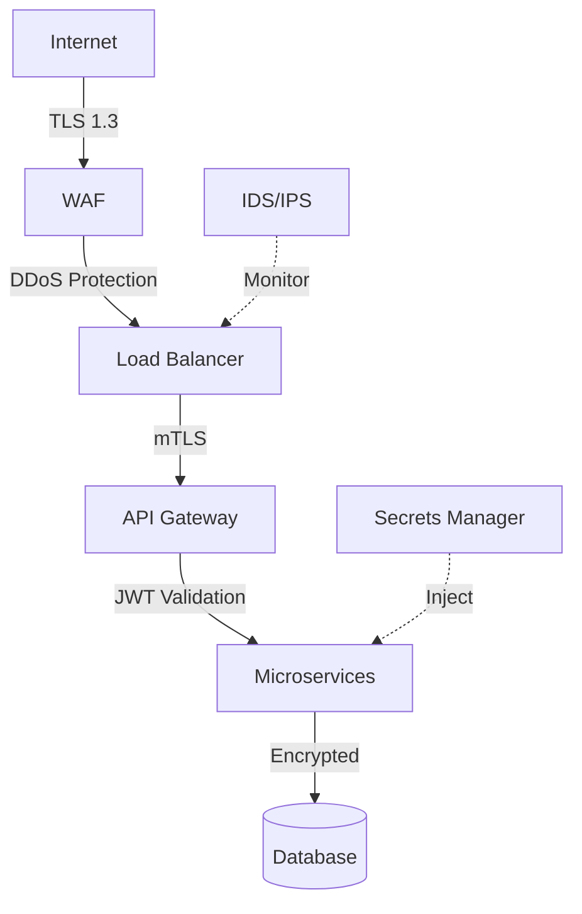

# IntelliGuard - Security & Compliance Document

**Version**: 1.0  
**Date**: November 2025  
**Classification**: Confidential  
**Compliance**: GDPR, PCI-DSS, SOC 2

---

## Table of Contents
1. [Security Architecture](#1-security-architecture)
2. [Authentication & Authorization](#2-authentication--authorization)
3. [Data Protection](#3-data-protection)
4. [Network Security](#4-network-security)
5. [Compliance](#5-compliance)
6. [Security Best Practices](#6-security-best-practices)
7. [Incident Response](#7-incident-response)

---

## 1. Security Architecture

### 1.1 Defense in Depth

IntelliGuard implements multiple layers of security:



**Security Layers**:
1. **Perimeter**: WAF, DDoS protection
2. **Network**: TLS, mTLS, VPC isolation
3. **Application**: JWT, RBAC, input validation
4. **Data**: Encryption at rest and in transit
5. **Monitoring**: SIEM, IDS/IPS, audit logs

---

## 2. Authentication & Authorization

### 2.1 Authentication Methods

#### 2.1.1 JWT (JSON Web Tokens)

**Algorithm**: RS256 (RSA with SHA-256)

**Token Structure**:
```json
{
  "header": {
    "alg": "RS256",
    "typ": "JWT",
    "kid": "key-id-123"
  },
  "payload": {
    "sub": "user-123",
    "email": "user@example.com",
    "role": "ANALYST",
    "permissions": ["READ_TRANSACTIONS", "MANAGE_RULES"],
    "iat": 1700000000,
    "exp": 1700003600,
    "iss": "intelliguard.io",
    "aud": "intelliguard-api"
  }
}
```

**Token Lifecycle**:
- **Access Token**: 1 hour expiry
- **Refresh Token**: 7 days expiry
- **Rotation**: Refresh tokens rotated on each use
- **Revocation**: Blacklist in Redis

**Implementation**:
```java
@Service
public class JwtService {
    
    private final RSAPrivateKey privateKey;
    private final RSAPublicKey publicKey;
    
    public String generateToken(User user) {
        return JWT.create()
            .withSubject(user.getId())
            .withClaim("email", user.getEmail())
            .withClaim("role", user.getRole())
            .withIssuedAt(new Date())
            .withExpiresAt(new Date(System.currentTimeMillis() + 3600000))
            .withIssuer("intelliguard.io")
            .sign(Algorithm.RSA256(publicKey, privateKey));
    }
    
    public DecodedJWT verifyToken(String token) {
        return JWT.require(Algorithm.RSA256(publicKey, privateKey))
            .withIssuer("intelliguard.io")
            .build()
            .verify(token);
    }
}
```

#### 2.1.2 API Keys

**Format**: `ig_live_<32-char-random-string>`

**Storage**: Hashed with SHA-256 in database

**Scopes**: Limited to specific endpoints (e.g., transaction ingestion only)

**Rotation**: Mandatory every 90 days

---

### 2.2 Authorization (RBAC)

#### 2.2.1 Roles

| Role | Permissions | Use Case |
|------|-------------|----------|
| **ADMIN** | Full system access | System administrators |
| **ANALYST** | Read transactions, manage rules, manage alerts | Fraud analysts |
| **VIEWER** | Read-only access | Auditors, stakeholders |
| **API_USER** | Ingest transactions only | External integrations |

#### 2.2.2 Permission Matrix

| Resource | ADMIN | ANALYST | VIEWER | API_USER |
|----------|-------|---------|--------|----------|
| Users | CRUD | - | R | - |
| Transactions | CRUD | R | R | C |
| Fraud Rules | CRUD | CRUD | R | - |
| Alerts | CRUD | CRUD | R | - |
| Models | CRUD | R | R | - |
| System Config | CRUD | - | - | - |

#### 2.2.3 Implementation

```java
@PreAuthorize("hasRole('ADMIN') or hasPermission(#userId, 'User', 'READ')")
public User getUserById(String userId) {
    // Method implementation
}

@PreAuthorize("hasAuthority('MANAGE_RULES')")
public FraudRule createRule(FraudRule rule) {
    // Method implementation
}
```

---

## 3. Data Protection

### 3.1 Encryption at Rest

**Database Encryption**:
- **Algorithm**: AES-256-GCM
- **Key Management**: AWS KMS / HashiCorp Vault
- **Scope**: All tables containing PII or sensitive data

**PostgreSQL Configuration**:
```sql
-- Enable transparent data encryption
ALTER SYSTEM SET ssl = on;
ALTER SYSTEM SET ssl_cert_file = '/path/to/server.crt';
ALTER SYSTEM SET ssl_key_file = '/path/to/server.key';
```

**Field-Level Encryption**:
```java
@Entity
public class User {
    @Id
    private Long id;
    
    @Convert(converter = EncryptedStringConverter.class)
    private String email;  // Encrypted at application level
    
    @Convert(converter = EncryptedStringConverter.class)
    private String phoneNumber;  // Encrypted
}

public class EncryptedStringConverter implements AttributeConverter<String, String> {
    
    @Override
    public String convertToDatabaseColumn(String attribute) {
        return vaultService.encrypt(attribute);
    }
    
    @Override
    public String convertToEntityAttribute(String dbData) {
        return vaultService.decrypt(dbData);
    }
}
```

---

### 3.2 Encryption in Transit

**TLS Configuration**:
- **Protocol**: TLS 1.3 only
- **Cipher Suites**: 
  - TLS_AES_256_GCM_SHA384
  - TLS_CHACHA20_POLY1305_SHA256
- **Certificate**: Let's Encrypt / AWS ACM
- **HSTS**: Enabled with 1-year max-age

**Spring Boot Configuration**:
```yaml
server:
  ssl:
    enabled: true
    key-store: classpath:keystore.p12
    key-store-password: ${KEYSTORE_PASSWORD}
    key-store-type: PKCS12
    key-alias: intelliguard
  http2:
    enabled: true
```

---

### 3.3 Data Masking

**PII Masking in Logs**:
```java
@Component
public class LogMaskingConverter extends MessageConverter {
    
    private static final Pattern EMAIL_PATTERN = 
        Pattern.compile("[a-zA-Z0-9._%+-]+@[a-zA-Z0-9.-]+\\.[a-zA-Z]{2,}");
    
    @Override
    public String convert(ILoggingEvent event) {
        String message = event.getFormattedMessage();
        return EMAIL_PATTERN.matcher(message)
            .replaceAll(match -> maskEmail(match.group()));
    }
    
    private String maskEmail(String email) {
        String[] parts = email.split("@");
        return parts[0].charAt(0) + "***@" + parts[1];
    }
}
```

**Database Views for Analysts**:
```sql
CREATE VIEW transactions_masked AS
SELECT 
    transaction_id,
    user_id,
    amount,
    currency,
    CONCAT(SUBSTRING(card_last4, 1, 2), '**') AS card_last4_masked,
    SUBSTRING(ip_address::text, 1, 7) || '***' AS ip_masked
FROM transactions;

GRANT SELECT ON transactions_masked TO analyst_role;
```

---

### 3.4 Data Retention & Deletion

**Retention Policies**:
```java
@Scheduled(cron = "0 0 2 * * SUN")  // Every Sunday at 2 AM
public void archiveOldData() {
    // Archive transactions older than 90 days
    LocalDateTime cutoffDate = LocalDateTime.now().minusDays(90);
    
    List<Transaction> oldTransactions = 
        transactionRepository.findByCreatedAtBefore(cutoffDate);
    
    // Export to S3
    s3Service.archive("transactions", oldTransactions);
    
    // Delete from database
    transactionRepository.deleteAll(oldTransactions);
    
    auditLog.log("DATA_ARCHIVED", oldTransactions.size() + " transactions");
}
```

**GDPR Right to be Forgotten**:
```java
@Transactional
public void deleteUserData(String userId) {
    // Soft delete user
    User user = userRepository.findById(userId)
        .orElseThrow(() -> new UserNotFoundException(userId));
    
    user.setStatus(UserStatus.DELETED);
    user.setDeletedAt(LocalDateTime.now());
    user.setEmail(null);  // Remove PII
    user.setPhoneNumber(null);
    
    // Anonymize transactions
    transactionRepository.anonymizeByUserId(userId);
    
    // Delete refresh tokens
    refreshTokenRepository.deleteByUserId(userId);
    
    auditLog.log("USER_DATA_DELETED", userId);
}
```

---

## 4. Network Security

### 4.1 VPC Architecture

```
┌─────────────────────────────────────────────────────────┐
│                      VPC (10.0.0.0/16)                   │
│                                                          │
│  ┌────────────────────────────────────────────────────┐ │
│  │  Public Subnet (10.0.1.0/24)                       │ │
│  │  - Load Balancer                                   │ │
│  │  - NAT Gateway                                     │ │
│  └────────────────────────────────────────────────────┘ │
│                                                          │
│  ┌────────────────────────────────────────────────────┐ │
│  │  Private Subnet - App (10.0.2.0/24)                │ │
│  │  - API Gateway                                     │ │
│  │  - Microservices                                   │ │
│  └────────────────────────────────────────────────────┘ │
│                                                          │
│  ┌────────────────────────────────────────────────────┐ │
│  │  Private Subnet - Data (10.0.3.0/24)               │ │
│  │  - PostgreSQL                                      │ │
│  │  - Redis                                           │ │
│  │  - Kafka                                           │ │
│  └────────────────────────────────────────────────────┘ │
└─────────────────────────────────────────────────────────┘
```

### 4.2 Security Groups

**Load Balancer SG**:
```yaml
Inbound:
  - Port 443 (HTTPS) from 0.0.0.0/0
  - Port 80 (HTTP) from 0.0.0.0/0 (redirect to 443)

Outbound:
  - All traffic to App Subnet SG
```

**Application SG**:
```yaml
Inbound:
  - Port 8080-8090 from Load Balancer SG
  - Port 8761 (Eureka) from Application SG

Outbound:
  - Port 5432 (PostgreSQL) to Data Subnet SG
  - Port 6379 (Redis) to Data Subnet SG
  - Port 9092 (Kafka) to Data Subnet SG
  - Port 443 (HTTPS) to 0.0.0.0/0 (external APIs)
```

**Database SG**:
```yaml
Inbound:
  - Port 5432 from Application SG only
  - Port 6379 from Application SG only
  - Port 9092 from Application SG only

Outbound:
  - None (no outbound access)
```

---

### 4.3 WAF Rules

**AWS WAF Configuration**:
```json
{
  "Rules": [
    {
      "Name": "RateLimitRule",
      "Priority": 1,
      "Statement": {
        "RateBasedStatement": {
          "Limit": 2000,
          "AggregateKeyType": "IP"
        }
      },
      "Action": {"Block": {}}
    },
    {
      "Name": "SQLInjectionRule",
      "Priority": 2,
      "Statement": {
        "SqliMatchStatement": {
          "FieldToMatch": {"AllQueryArguments": {}},
          "TextTransformations": [{"Priority": 0, "Type": "URL_DECODE"}]
        }
      },
      "Action": {"Block": {}}
    },
    {
      "Name": "XSSRule",
      "Priority": 3,
      "Statement": {
        "XssMatchStatement": {
          "FieldToMatch": {"Body": {}},
          "TextTransformations": [{"Priority": 0, "Type": "HTML_ENTITY_DECODE"}]
        }
      },
      "Action": {"Block": {}}
    }
  ]
}
```

---

## 5. Compliance

### 5.1 GDPR Compliance

**Data Subject Rights**:
1. **Right to Access**: API endpoint `/api/v1/users/{id}/data-export`
2. **Right to Rectification**: Update user profile
3. **Right to Erasure**: Soft delete with anonymization
4. **Right to Data Portability**: Export in JSON format
5. **Right to Object**: Opt-out of processing

**Implementation**:
```java
@GetMapping("/users/{userId}/data-export")
@PreAuthorize("hasRole('ADMIN') or #userId == authentication.principal.id")
public ResponseEntity<UserDataExport> exportUserData(@PathVariable String userId) {
    UserDataExport export = new UserDataExport();
    export.setUser(userService.findById(userId));
    export.setTransactions(transactionService.findByUserId(userId));
    export.setAlerts(alertService.findByUserId(userId));
    
    auditLog.log("DATA_EXPORT_REQUESTED", userId);
    
    return ResponseEntity.ok(export);
}
```

**Consent Management**:
```sql
CREATE TABLE user_consents (
    id BIGSERIAL PRIMARY KEY,
    user_id BIGINT REFERENCES users(id),
    consent_type VARCHAR(50) NOT NULL,
    granted BOOLEAN NOT NULL,
    granted_at TIMESTAMP,
    revoked_at TIMESTAMP,
    ip_address INET,
    
    CONSTRAINT chk_consent_type CHECK (consent_type IN (
        'DATA_PROCESSING',
        'MARKETING',
        'ANALYTICS',
        'THIRD_PARTY_SHARING'
    ))
);
```

---

### 5.2 PCI-DSS Compliance

**Requirements**:
1. **Build and Maintain Secure Network**: Firewall, no default passwords
2. **Protect Cardholder Data**: Encryption, tokenization
3. **Maintain Vulnerability Management**: Patching, antivirus
4. **Implement Strong Access Control**: RBAC, MFA
5. **Monitor and Test Networks**: Logging, penetration testing
6. **Maintain Information Security Policy**: Documentation, training

**Card Data Handling**:
```java
// Never store full PAN, CVV, or PIN
@Entity
public class Transaction {
    @Id
    private Long id;
    
    private String cardLast4;  // Only last 4 digits
    private String cardBin;    // First 6 digits (for fraud detection)
    
    // CVV MUST NEVER be stored
    // Full PAN should be tokenized via payment gateway
}
```

**Tokenization**:
```java
public String tokenizeCard(String pan) {
    // Use payment gateway tokenization (Stripe, Adyen)
    return stripeClient.createToken(pan).getId();
}
```

---

### 5.3 SOC 2 Type II

**Trust Service Criteria**:
1. **Security**: Access controls, encryption, monitoring
2. **Availability**: 99.9% uptime SLA
3. **Processing Integrity**: Data validation, error handling
4. **Confidentiality**: NDA, data classification
5. **Privacy**: GDPR compliance, consent management

**Audit Trail**:
```java
@Aspect
@Component
public class AuditAspect {
    
    @Around("@annotation(Audited)")
    public Object auditMethod(ProceedingJoinPoint joinPoint) throws Throwable {
        String methodName = joinPoint.getSignature().getName();
        Object[] args = joinPoint.getArgs();
        
        AuditLog log = new AuditLog();
        log.setAction(methodName);
        log.setUserId(SecurityContextHolder.getContext().getAuthentication().getName());
        log.setTimestamp(LocalDateTime.now());
        log.setOldValues(serializeArgs(args));
        
        Object result = joinPoint.proceed();
        
        log.setNewValues(serializeResult(result));
        auditLogRepository.save(log);
        
        return result;
    }
}
```

---

## 6. Security Best Practices

### 6.1 Input Validation

```java
@RestController
@Validated
public class TransactionController {
    
    @PostMapping("/transactions")
    public ResponseEntity<Transaction> createTransaction(
        @Valid @RequestBody TransactionRequest request) {
        
        // Additional validation
        if (request.getAmount().compareTo(BigDecimal.ZERO) <= 0) {
            throw new ValidationException("Amount must be positive");
        }
        
        // Sanitize inputs
        String sanitizedMerchant = sanitize(request.getMerchantName());
        
        return ResponseEntity.ok(transactionService.create(request));
    }
    
    private String sanitize(String input) {
        return Jsoup.clean(input, Whitelist.none());
    }
}
```

### 6.2 SQL Injection Prevention

```java
// GOOD: Parameterized queries
@Query("SELECT t FROM Transaction t WHERE t.userId = :userId AND t.amount > :amount")
List<Transaction> findByUserIdAndAmountGreaterThan(
    @Param("userId") String userId, 
    @Param("amount") BigDecimal amount);

// BAD: String concatenation (NEVER DO THIS)
// String query = "SELECT * FROM transactions WHERE user_id = '" + userId + "'";
```

### 6.3 Secrets Management

**HashiCorp Vault Integration**:
```java
@Configuration
public class VaultConfig {
    
    @Bean
    public VaultTemplate vaultTemplate() {
        VaultEndpoint endpoint = VaultEndpoint.create("vault.example.com", 8200);
        VaultToken token = VaultToken.of(System.getenv("VAULT_TOKEN"));
        
        return new VaultTemplate(endpoint, 
            new TokenAuthentication(token));
    }
}

@Service
public class SecretService {
    
    @Autowired
    private VaultTemplate vaultTemplate;
    
    public String getSecret(String path) {
        VaultResponse response = vaultTemplate.read("secret/data/" + path);
        return (String) response.getData().get("value");
    }
}
```

---

## 7. Incident Response

### 7.1 Incident Response Plan

**Phases**:
1. **Preparation**: Training, tools, runbooks
2. **Detection**: SIEM alerts, anomaly detection
3. **Containment**: Isolate affected systems
4. **Eradication**: Remove threat
5. **Recovery**: Restore services
6. **Lessons Learned**: Post-mortem analysis

### 7.2 Security Incident Runbook

**Data Breach Response**:
```markdown
1. Immediate Actions (0-1 hour):
   - Isolate affected systems
   - Preserve evidence (logs, memory dumps)
   - Notify security team
   - Activate incident response team

2. Assessment (1-4 hours):
   - Determine scope of breach
   - Identify compromised data
   - Assess impact

3. Containment (4-24 hours):
   - Revoke compromised credentials
   - Patch vulnerabilities
   - Block malicious IPs

4. Notification (24-72 hours):
   - Notify affected users (GDPR: within 72 hours)
   - Report to authorities if required
   - Public disclosure if necessary

5. Recovery (1-2 weeks):
   - Restore from backups
   - Implement additional controls
   - Monitor for re-infection

6. Post-Incident (2-4 weeks):
   - Root cause analysis
   - Update security policies
   - Conduct training
```

---

**Document Control**

| Version | Date | Author | Changes |
|---------|------|--------|---------|
| 1.0 | Nov 2025 | Security Team | Initial document |
