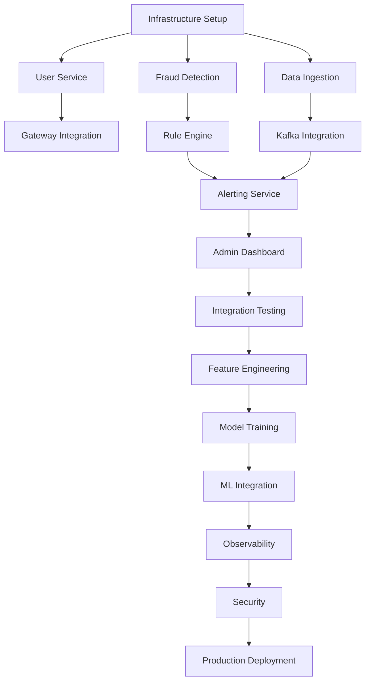

# IntelliGuard - Implementation Plan

**Version**: 1.0  
**Date**: November 2025  
**Timeline**: 10 months (MVP to Production)  
**Team Size**: 5-6 engineers

---

## Table of Contents
1. [Overview](#1-overview)
2. [Phase 1: MVP Foundation](#2-phase-1-mvp-foundation)
3. [Phase 2: ML Integration](#3-phase-2-ml-integration)
4. [Phase 3: Production Hardening](#4-phase-3-production-hardening)
5. [Sprint Planning](#5-sprint-planning)
6. [Risk Management](#6-risk-management)

---

## 1. Overview

### 1.1 Implementation Strategy

**Approach**: Agile with 2-week sprints  
**Methodology**: Scrum  
**Deployment**: Continuous deployment to staging, manual approval for production

### 1.2 Success Criteria

| Phase | Success Metric |
|-------|----------------|
| Phase 1 | Process 1,000 TPS with rule-based detection |
| Phase 2 | Achieve 95% fraud detection rate with ML |
| Phase 3 | 99.9% uptime, <100ms latency at 10K TPS |

### 1.3 Team Allocation

| Role | Phase 1 | Phase 2 | Phase 3 |
|------|---------|---------|---------|
| Backend Engineers (2) | 100% | 80% | 60% |
| ML Engineer (1) | 20% | 100% | 40% |
| Frontend Engineer (1) | 60% | 80% | 40% |
| DevOps Engineer (1) | 40% | 40% | 100% |

---

## 2. Phase 1: MVP Foundation (Months 1-4)

**Goal**: Build core fraud detection platform with rule-based engine

### Sprint 1-2: Infrastructure & User Service (Weeks 1-4)

#### Sprint 1: Infrastructure Setup
**Duration**: 2 weeks  
**Team**: Full team

**Tasks**:
- [x] ~~Set up Git repository and branching strategy~~
- [x] ~~Create comprehensive documentation~~
- [ ] **Fix critical issues** (port conflicts, credentials)
- [ ] Set up local development environment
- [ ] Configure Docker Compose for all infrastructure
- [ ] Set up PostgreSQL with initial schema
- [ ] Configure Kafka topics
- [ ] Set up Redis for caching

**Deliverables**:
- Working Docker Compose setup
- All infrastructure services running
- Development environment guide

**Definition of Done**:
- All developers can run full stack locally
- Infrastructure health checks passing
- Documentation updated

---

#### Sprint 2: User Service Foundation
**Duration**: 2 weeks  
**Owner**: Backend Engineer 1

**Tasks**:
- [ ] Create User entity and repository
- [ ] Implement user registration endpoint
- [ ] Implement password hashing (bcrypt)
- [ ] Build login endpoint with JWT generation
- [ ] Implement refresh token mechanism
- [ ] Add password reset functionality
- [ ] Create role and permission tables
- [ ] Implement RBAC authorization
- [ ] Write unit tests (70%+ coverage)
- [ ] API documentation (OpenAPI/Swagger)

**Deliverables**:
- User Service with full authentication
- JWT-based auth working
- Postman collection for testing

**Definition of Done**:
- All endpoints tested and documented
- Unit tests passing
- Integration with Gateway working

---

### Sprint 3-4: Fraud Detection - Rule Engine (Weeks 5-8)

#### Sprint 3: Rule Engine Core
**Duration**: 2 weeks  
**Owner**: Backend Engineer 2

**Tasks**:
- [ ] Design rule engine architecture
- [ ] Implement rule evaluation framework
- [ ] Create rule storage (PostgreSQL)
- [ ] Build rule CRUD API
- [ ] Implement threshold rules
- [ ] Implement velocity rules
- [ ] Add rule priority and ordering
- [ ] Create rule testing framework
- [ ] Write unit tests

**Deliverables**:
- Rule engine processing transactions
- Rule management API
- 5+ predefined rules

**Definition of Done**:
- Rules can be created, updated, deleted
- Rules execute correctly on transactions
- Performance: <50ms per rule evaluation

---

#### Sprint 4: Advanced Rules & Integration
**Duration**: 2 weeks  
**Owner**: Backend Engineer 2

**Tasks**:
- [ ] Implement geo-location rules (MaxMind integration)
- [ ] Add blacklist functionality (IP, user, device)
- [ ] Create risk scoring algorithm
- [ ] Implement decision engine (ALLOW/BLOCK/REVIEW)
- [ ] Add reason code generation
- [ ] Integrate with Kafka for async processing
- [ ] Performance optimization
- [ ] Load testing (1000 TPS)

**Deliverables**:
- Complete rule engine
- Decision engine working
- Performance benchmarks

**Definition of Done**:
- All rule types implemented
- Can process 1000 TPS
- Integration tests passing

---

### Sprint 5-6: Data Ingestion Service (Weeks 9-12)

#### Sprint 5: Ingestion API
**Duration**: 2 weeks  
**Owner**: Backend Engineer 1

**Tasks**:
- [ ] Create Data Ingestion Service skeleton
- [ ] Build transaction ingestion REST API
- [ ] Implement JSON schema validation
- [ ] Add data normalization
- [ ] Implement idempotency (Redis-based)
- [ ] Add rate limiting
- [ ] Integrate GeoIP enrichment
- [ ] Set up Kafka producers
- [ ] Write unit tests

**Deliverables**:
- Transaction ingestion API
- Schema validation working
- Kafka integration

**Definition of Done**:
- API accepts and validates transactions
- Data enriched and published to Kafka
- Rate limiting working (1000 req/min)

---

#### Sprint 6: Batch Processing & Error Handling
**Duration**: 2 weeks  
**Owner**: Backend Engineer 1

**Tasks**:
- [ ] Implement batch ingestion endpoint
- [ ] Add dead letter queue (DLQ) for failed messages
- [ ] Implement retry mechanism
- [ ] Add comprehensive error handling
- [ ] Create monitoring metrics
- [ ] Performance optimization
- [ ] Load testing
- [ ] Documentation

**Deliverables**:
- Batch ingestion working
- Error handling robust
- Performance validated

**Definition of Done**:
- Can ingest 1000 transactions in batch
- DLQ handling failed messages
- Metrics exposed for monitoring

---

### Sprint 7-8: Alerting Service & Dashboard (Weeks 13-16)

#### Sprint 7: Alerting Service
**Duration**: 2 weeks  
**Owner**: Backend Engineer 2

**Tasks**:
- [ ] Create Alerting Service
- [ ] Implement Kafka consumer for fraud decisions
- [ ] Build alert generation logic
- [ ] Integrate SendGrid for email
- [ ] Integrate Twilio for SMS
- [ ] Add Slack webhook support
- [ ] Implement alert deduplication
- [ ] Create alert management API
- [ ] Write unit tests

**Deliverables**:
- Multi-channel alerting working
- Alert management API
- Integration tests

**Definition of Done**:
- Alerts sent via email, SMS, Slack
- Alert CRUD operations working
- Deduplication preventing spam

---

#### Sprint 8: Admin Dashboard (Basic)
**Duration**: 2 weeks  
**Owner**: Frontend Engineer

**Tasks**:
- [ ] Set up React + TypeScript + Vite project
- [ ] Configure Tailwind CSS
- [ ] Create authentication flow (login, logout)
- [ ] Build dashboard layout
- [ ] Implement real-time metrics display
- [ ] Create transaction list view
- [ ] Add transaction detail view
- [ ] Build rule management UI (CRUD)
- [ ] Add alert list and management
- [ ] Implement WebSocket/SSE for real-time updates

**Deliverables**:
- Working admin dashboard
- Authentication integrated
- Real-time metrics

**Definition of Done**:
- Users can log in and view dashboard
- Transactions displayed in real-time
- Rules can be managed via UI

---

### Sprint 9-10: Integration & Testing (Weeks 17-20)

#### Sprint 9: Integration Testing
**Duration**: 2 weeks  
**Owner**: Full team

**Tasks**:
- [ ] End-to-end integration testing
- [ ] API contract testing (Pact)
- [ ] Cross-service communication testing
- [ ] Database migration testing
- [ ] Kafka message flow testing
- [ ] Error scenario testing
- [ ] Bug fixes

**Deliverables**:
- Integration test suite
- Bug fixes completed
- System stability validated

---

#### Sprint 10: Performance & Security Testing
**Duration**: 2 weeks  
**Owner**: Full team + DevOps

**Tasks**:
- [ ] Performance testing (JMeter/Gatling)
- [ ] Load testing (1000 TPS sustained)
- [ ] Stress testing (find breaking point)
- [ ] Security testing (OWASP ZAP)
- [ ] Penetration testing
- [ ] Vulnerability scanning
- [ ] Performance optimization
- [ ] Security hardening

**Deliverables**:
- Performance test results
- Security audit report
- Optimizations implemented

**Definition of Done**:
- System handles 1000 TPS with <100ms latency
- No critical security vulnerabilities
- All tests passing

---

## 3. Phase 2: ML Integration (Months 5-7)

**Goal**: Add machine learning-based fraud detection

### Sprint 11-12: Feature Engineering (Weeks 21-24)

#### Sprint 11: Feature Engineering Service
**Duration**: 2 weeks  
**Owner**: ML Engineer + Backend Engineer 1

**Tasks**:
- [ ] Design feature engineering architecture
- [ ] Set up Kafka Streams application
- [ ] Implement transaction features
- [ ] Implement user features
- [ ] Implement velocity features
- [ ] Implement geo features
- [ ] Create feature store (Redis)
- [ ] Add feature versioning

**Deliverables**:
- Feature Engineering Service
- 20+ features computed
- Feature store operational

---

#### Sprint 12: Historical Features & Optimization
**Duration**: 2 weeks  
**Owner**: ML Engineer

**Tasks**:
- [ ] Implement historical feature aggregation
- [ ] Add peer group features
- [ ] Optimize feature computation
- [ ] Create feature monitoring
- [ ] Performance testing
- [ ] Documentation

**Deliverables**:
- Complete feature set (30+ features)
- Performance optimized
- Feature documentation

---

### Sprint 13-14: Model Training (Weeks 25-28)

#### Sprint 13: ML Pipeline Setup
**Duration**: 2 weeks  
**Owner**: ML Engineer

**Tasks**:
- [ ] Set up Python ML environment
- [ ] Create training data pipeline
- [ ] Implement data preprocessing
- [ ] Build baseline models (Logistic Regression, Random Forest)
- [ ] Set up MLflow for experiment tracking
- [ ] Create model evaluation framework
- [ ] Train initial models
- [ ] Evaluate model performance

**Deliverables**:
- ML training pipeline
- Baseline models trained
- MLflow tracking working

---

#### Sprint 14: Advanced Models & Optimization
**Duration**: 2 weeks  
**Owner**: ML Engineer

**Tasks**:
- [ ] Train XGBoost model
- [ ] Train Neural Network model
- [ ] Hyperparameter tuning
- [ ] Cross-validation
- [ ] Feature importance analysis
- [ ] Model explainability (SHAP)
- [ ] Model versioning
- [ ] Export models to S3

**Deliverables**:
- 4 trained models
- Model performance report
- Best model selected

**Target Metrics**:
- Precision: >90%
- Recall: >95%
- F1 Score: >92%
- AUC-ROC: >0.95

---

### Sprint 15-16: ML Integration (Weeks 29-32)

#### Sprint 15: Model Serving
**Duration**: 2 weeks  
**Owner**: ML Engineer + Backend Engineer 2

**Tasks**:
- [ ] Create Model Training Service (Python/FastAPI)
- [ ] Implement model loading from S3
- [ ] Build model inference API
- [ ] Integrate with Fraud Detection Service
- [ ] Implement model fallback mechanism
- [ ] Add model versioning support
- [ ] Performance optimization
- [ ] Load testing

**Deliverables**:
- Model serving API
- Integration with fraud detection
- Performance validated

---

#### Sprint 16: A/B Testing & Monitoring
**Duration**: 2 weeks  
**Owner**: ML Engineer + Frontend Engineer

**Tasks**:
- [ ] Implement A/B testing framework
- [ ] Create model performance monitoring
- [ ] Build model metrics dashboard
- [ ] Add model drift detection
- [ ] Implement automated retraining triggers
- [ ] Create model comparison UI
- [ ] Documentation

**Deliverables**:
- A/B testing working
- Model monitoring dashboard
- Drift detection active

---

## 4. Phase 3: Production Hardening (Months 8-10)

**Goal**: Production-ready system with full observability and security

### Sprint 17-18: Observability (Weeks 33-36)

#### Sprint 17: Metrics & Monitoring
**Duration**: 2 weeks  
**Owner**: DevOps Engineer

**Tasks**:
- [ ] Set up Prometheus
- [ ] Configure service metrics collection
- [ ] Set up Grafana
- [ ] Create service dashboards
- [ ] Create business metrics dashboards
- [ ] Configure alerting rules
- [ ] Set up PagerDuty integration
- [ ] Documentation

**Deliverables**:
- Prometheus + Grafana stack
- 10+ dashboards
- Alerting configured

---

#### Sprint 18: Logging & Tracing
**Duration**: 2 weeks  
**Owner**: DevOps Engineer

**Tasks**:
- [ ] Set up ELK stack (Elasticsearch, Logstash, Kibana)
- [ ] Configure structured logging
- [ ] Implement log aggregation
- [ ] Set up Jaeger for distributed tracing
- [ ] Add trace IDs to all requests
- [ ] Create log dashboards
- [ ] Configure log retention
- [ ] Documentation

**Deliverables**:
- ELK stack operational
- Distributed tracing working
- Log dashboards created

---

### Sprint 19-20: Security & Compliance (Weeks 37-40)

#### Sprint 19: Security Hardening
**Duration**: 2 weeks  
**Owner**: Backend Engineer 1 + DevOps

**Tasks**:
- [ ] Set up HashiCorp Vault
- [ ] Migrate secrets to Vault
- [ ] Implement field-level encryption
- [ ] Add OAuth 2.0 / Keycloak
- [ ] Implement MFA
- [ ] Set up WAF rules
- [ ] Configure security groups
- [ ] Security audit

**Deliverables**:
- Vault operational
- OAuth 2.0 working
- Security hardened

---

#### Sprint 20: Compliance Features
**Duration**: 2 weeks  
**Owner**: Backend Engineer 2

**Tasks**:
- [ ] Implement GDPR features (data export, deletion)
- [ ] Add consent management
- [ ] Implement data retention policies
- [ ] Add audit logging
- [ ] Create compliance reports
- [ ] PCI-DSS compliance review
- [ ] Documentation

**Deliverables**:
- GDPR compliance
- Audit trail complete
- Compliance documentation

---

### Sprint 21-22: DevOps & Deployment (Weeks 41-44)

#### Sprint 21: CI/CD Pipeline
**Duration**: 2 weeks  
**Owner**: DevOps Engineer

**Tasks**:
- [ ] Set up GitHub Actions workflows
- [ ] Configure automated testing
- [ ] Add security scanning (SonarQube, Snyk, Trivy)
- [ ] Set up Docker image building
- [ ] Configure container registry
- [ ] Implement staging deployment
- [ ] Add smoke tests
- [ ] Documentation

**Deliverables**:
- CI/CD pipeline operational
- Automated deployments to staging
- Security scanning integrated

---

#### Sprint 22: Kubernetes & Production Deployment
**Duration**: 2 weeks  
**Owner**: DevOps Engineer

**Tasks**:
- [ ] Create Kubernetes manifests
- [ ] Set up Helm charts
- [ ] Configure auto-scaling (HPA)
- [ ] Implement blue-green deployment
- [ ] Set up ingress and load balancing
- [ ] Configure SSL/TLS certificates
- [ ] Production deployment
- [ ] Disaster recovery setup
- [ ] Runbook creation

**Deliverables**:
- Kubernetes deployment working
- Production environment live
- DR plan documented

---

## 5. Sprint Planning

### Sprint Structure

**Duration**: 2 weeks  
**Ceremonies**:
- Sprint Planning: Monday Week 1 (2 hours)
- Daily Standup: Every day (15 minutes)
- Sprint Review: Friday Week 2 (1 hour)
- Sprint Retrospective: Friday Week 2 (1 hour)

### Sprint Velocity

**Estimated Story Points per Sprint**: 40-50 points  
**Team Capacity**: 5 engineers × 8 hours/day × 10 days = 400 hours per sprint

### Dependencies

---

## 6. Risk Management

### High-Risk Items

| Risk | Impact | Probability | Mitigation |
|------|--------|-------------|------------|
| **Kafka complexity** | High | Medium | Start with simple pub/sub, add complexity gradually |
| **ML model accuracy** | High | Medium | Build strong baseline with rules, ML is enhancement |
| **Performance bottlenecks** | High | Medium | Early load testing, identify bottlenecks in Phase 1 |
| **Security vulnerabilities** | Critical | Low | Regular security audits, automated scanning |
| **Team knowledge gaps** | Medium | High | Training sessions, pair programming, documentation |

### Contingency Plans

**If ML models underperform**:
- Fall back to rule-based detection
- Extend Phase 2 by 1 month
- Bring in ML consultant

**If performance targets not met**:
- Optimize database queries
- Add caching layers
- Scale horizontally
- Consider read replicas

**If timeline slips**:
- Reduce scope of Phase 3
- Delay advanced features
- Focus on core MVP

---

## 7. Milestones & Checkpoints

| Milestone | Date | Deliverable |
|-----------|------|-------------|
| **M1: Infrastructure Ready** | End of Sprint 1 | All services can run locally |
| **M2: Authentication Working** | End of Sprint 2 | Users can register and login |
| **M3: Rule Engine Complete** | End of Sprint 4 | Fraud detection with rules |
| **M4: End-to-End Flow** | End of Sprint 8 | Transaction → Detection → Alert → Dashboard |
| **M5: MVP Launch** | End of Sprint 10 | Production-ready rule-based system |
| **M6: ML Integration** | End of Sprint 16 | ML models in production |
| **M7: Production Hardening** | End of Sprint 22 | Full observability and security |

---

## 8. Success Metrics

### Technical Metrics
- **Uptime**: 99.9%
- **Latency**: <100ms (p95)
- **Throughput**: 10,000 TPS
- **Test Coverage**: >70%
- **Security Vulnerabilities**: 0 critical, 0 high

### Business Metrics
- **Fraud Detection Rate**: >95%
- **False Positive Rate**: <5%
- **Alert Response Time**: <5 minutes
- **System Availability**: 99.9%

### Team Metrics
- **Sprint Velocity**: 40-50 story points
- **Sprint Completion Rate**: >90%
- **Bug Escape Rate**: <5%
- **Code Review Time**: <24 hours

---

**Document Control**

| Version | Date | Author | Changes |
|---------|------|--------|---------|
| 1.0 | Nov 2025 | Product Team | Initial implementation plan |
